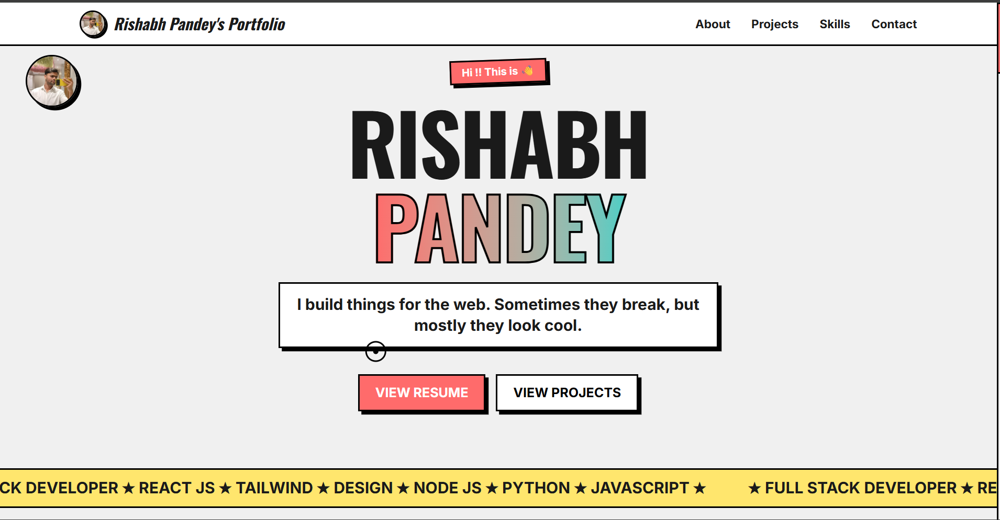
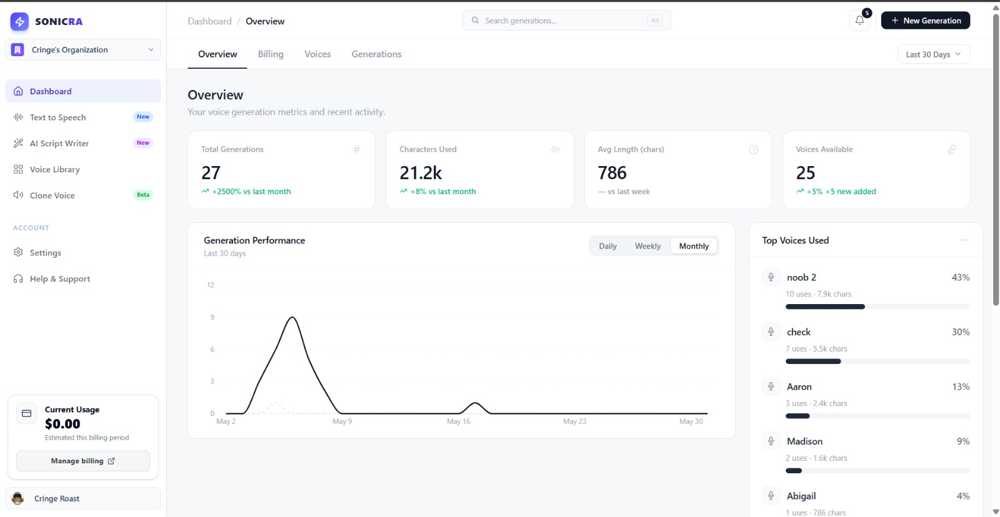
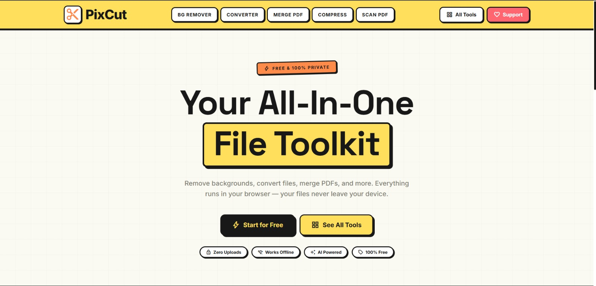
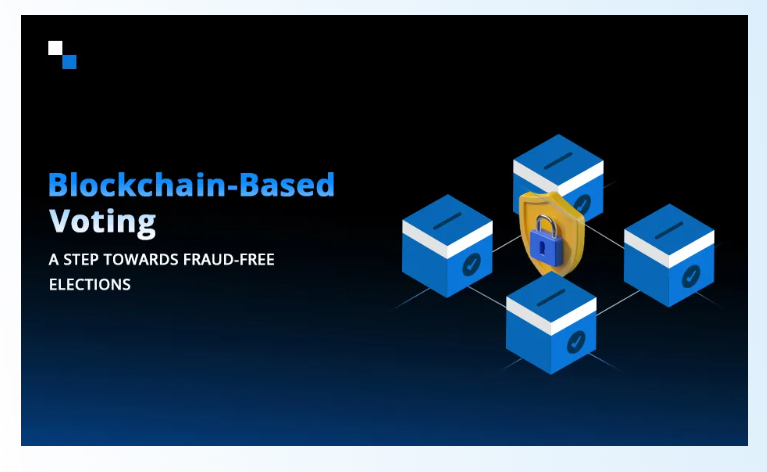
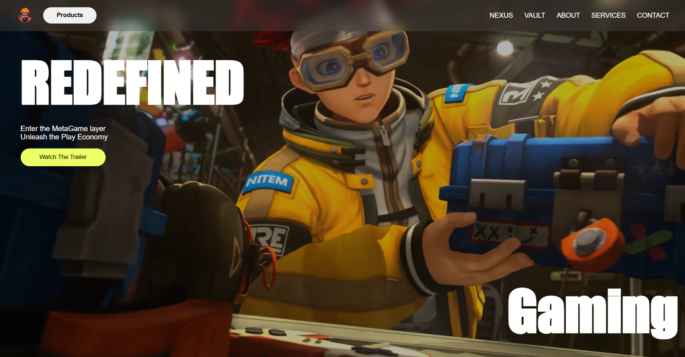
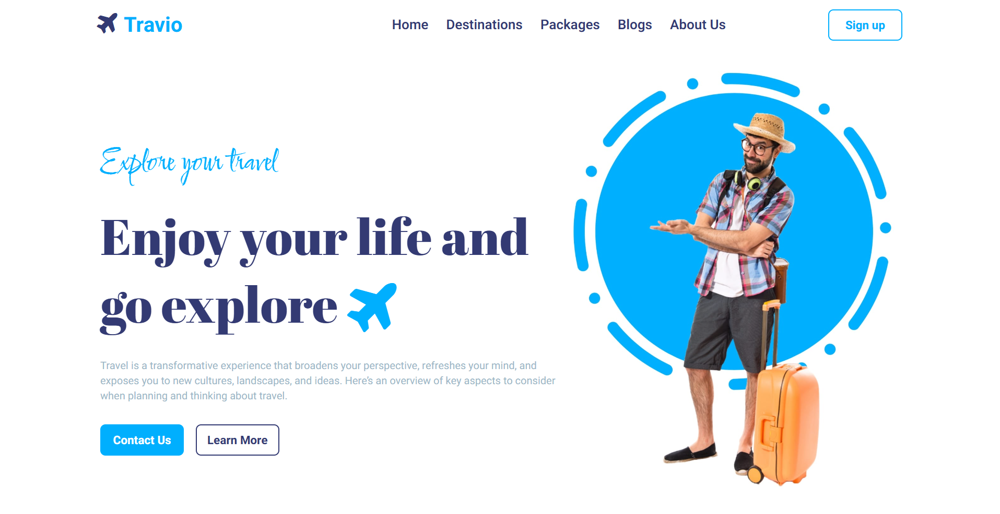
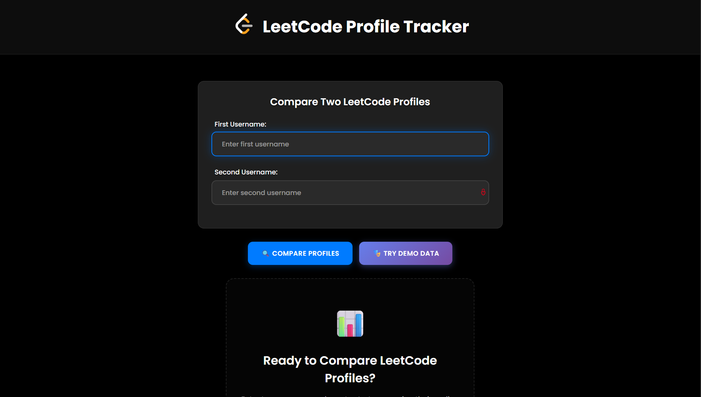

  

  # 🚀 Rishabh Portfolio

  ### ⚡ Rishabh Pandey's Developer Portfolio

  

    <strong>Full Stack Developer • React Developer • AI Project Builder • Web3 Learner</strong>
  

  

    🎨 Neo-Brutalist UI &nbsp;•&nbsp;
    ⚛️ React Powered &nbsp;•&nbsp;
    📱 Fully Responsive &nbsp;•&nbsp;
    🧠 AI Projects &nbsp;•&nbsp;
    🔗 Web3 Projects
  

  

    
    
    
    
  

  

    
    
    
  

---

## 🏠 Homepage Preview

This is the real homepage preview of **Rishabh Portfolio**.

---

## 👨‍💻 About

**Rishabh Portfolio** is my personal developer portfolio built to showcase my projects, skills, education, and contact links in a bold and memorable way.

The design uses a neo-brutalist style with strong borders, bright colors, hard shadows, large typography, animated interactions, and a custom profile-focused hero section.

---

## ✨ Features

- 🎨 Bold neo-brutalist UI
- 📱 Responsive design for mobile, tablet, and desktop
- ⚛️ React component-based architecture
- 🎞️ Framer Motion animations
- 🖱️ Custom animated cursor
- 🧩 Project cards with real screenshots
- 🛠️ Skill categories with icons
- 🎓 Education section
- 📬 Contact form
- 📊 GitHub calendar
- 📈 Vercel Analytics

---

## 🚀 Projects

### 🎙️ Sonicra

**Sonicra** is a voice generation platform built with **TypeScript**, **React**, and voice AI tools.

🔗 **GitHub:** [https://github.com/rishabhdev0/Sonicra-](https://github.com/rishabhdev0/Sonicra-)

---

### ✂️ FlixCut

**FlixCut** is an all-in-one browser-based file toolkit for useful file operations.

🔗 **GitHub:** [https://github.com/rishabhdev0/FlixCut](https://github.com/rishabhdev0/FlixCut)

---

### 🗳️ Decentralized Voting System

**Decentralized Voting System** is a Web3 voting project focused on secure and transparent voting flows.

🚧 **Demo:** Under construction  
🚧 **GitHub:** Under construction

---

### 🎮 Gaming Hub

**Gaming Hub** is a modern gaming landing page with animated visuals and immersive design elements.

🔗 **Live Demo:** [https://rishabhdev0.github.io/gamingpwebsite/](https://rishabhdev0.github.io/gamingpwebsite/)  
🔗 **GitHub:** [https://github.com/rishabhdev0/gamingpwebsite](https://github.com/rishabhdev0/gamingpwebsite)

---

### 🌍 Travio

**Travio** is a travel booking platform with destination browsing, responsive UI, and clean travel-focused layout.

🚧 **Demo:** Not available  
🔗 **GitHub:** [https://github.com/rishabhdev0/Travio](https://github.com/rishabhdev0/Travio)

---

### 🧮 LeetCodolio

**LeetCodolio** automatically builds a portfolio-style page from LeetCode statistics.

🔗 **Live Demo:** [https://leetcodolio.RishabhPandey.app](https://leetcodolio.RishabhPandey.app)  
🔗 **GitHub:** [https://github.com/rishabhdev0/LeetCodolio-Frontend](https://github.com/rishabhdev0/LeetCodolio-Frontend)

---

## 🛠️ Tech Stack

---

## 📬 Direct Links

| Platform | Link |
| --- | --- |
| 🐙 GitHub | [https://github.com/rishabhdev0](https://github.com/rishabhdev0) |
| 💼 LinkedIn | [https://www.linkedin.com/in/rishabh-pandey-254a08285/](https://www.linkedin.com/in/rishabh-pandey-254a08285/) |
| 🐦 X / Twitter | [https://x.com/Rishabh58750540](https://x.com/Rishabh58750540) |
| 📧 Email | [mailto:rishabh52003@gmail.com](mailto:rishabh52003@gmail.com) |
| 🧩 LeetCode | [https://leetcode.com/u/rishabh_code/](https://leetcode.com/u/rishabh_code/) |
| 🏁 Codeforces | [https://codeforces.com/profile/rishabh_code](https://codeforces.com/profile/rishabh_code) |
| 📦 Portfolio Repo | [https://github.com/rishabhdev0/Portfolio](https://github.com/rishabhdev0/Portfolio) |

---

## ⭐ Support

If you like this portfolio, give the repository a star.

### ⭐ [Star Rishabh Portfolio](https://github.com/rishabhdev0/Portfolio) ⭐

**Built and maintained by Rishabh Pandey**

