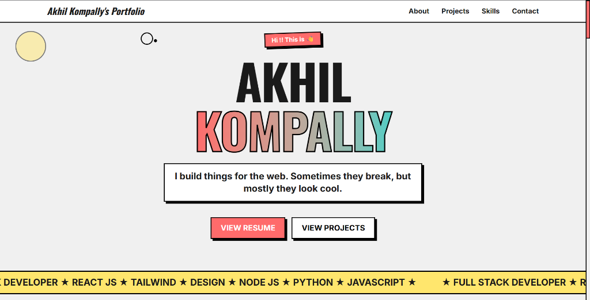

# Rishabh Pandey's Portfolio



A bold, animated, neo-brutalist developer portfolio built to present my projects, skills, education, and contact details with a strong visual identity. This portfolio is designed as a personal engineering homepage: fast to scan, responsive across devices, easy to maintain, and expressive enough to stand out from a generic template.

## ✨ Highlights

- 🎨 Neo-brutalist UI with thick borders, hard shadows, bold typography, and playful motion
- ⚡ Vite + React app with a simple, maintainable component structure
- 📱 Fully responsive project and skills sections
- 🧠 Project showcase for AI, file tooling, gaming, travel, and Web3 work
- 🛠️ Categorized skills with custom technology icons
- 🖱️ Custom animated cursor for desktop users
- 📬 Contact form powered by Web3Forms
- 📊 GitHub contribution calendar integration
- 📈 Vercel Analytics support

## 🧑‍💻 About

This portfolio represents my work as a developer who enjoys building practical, visually memorable web experiences. It includes a hero introduction, project cards, skill categories, education details, social links, and a contact section.

The codebase is intentionally straightforward. Most content is stored inside React component data arrays, making it easy to add projects, update skills, replace screenshots, or tune copy without digging through complex state management.

## 🚀 Featured Projects

The project section currently displays six projects:

| Project | Description | Status |
| --- | --- | --- |
| Sonicra | Voice generation platform with TypeScript, React, voice AI tools, and analytics | Active |
| FlixCut | Browser-based file toolkit for conversion, PDF tools, compression, and private client-side utilities | Active |
| Decentralized Voting System | Web3 voting concept with smart contract and transparent election flow | Under construction |
| Gaming Hub | Gaming landing page with interactive and animated visuals | Active |
| Travio | Travel booking platform with destination browsing and responsive UI | Demo unavailable |
| LeetCodolio | Portfolio generator based on LeetCode stats | Active |

## 🛠️ Tech Stack

### Core

- ⚛️ React 19
- ⚡ Vite 7
- 🎨 Tailwind CSS 4
- 🎞️ Framer Motion
- 🧩 Lucide React

### Integrations

- 📊 React GitHub Calendar
- 📈 Vercel Analytics
- 📬 Web3Forms

### Skills Displayed

- Languages: C++, JavaScript, Python, Solidity
- Web Development: WebSockets, WebRTC, REST API, GraphQL
- Frameworks: React.js, Express.js, Next.js, Tailwind CSS
- Databases: MongoDB, MySQL, Redis
- Tools & DevOps: Git, GitHub, Postman, AWS Basics

## 📁 Project Structure

```txt
Portfolio/
├── public/
│   ├── og-image.png
│   ├── vite.svg
│   └── skills/
│       └── technology icons
├── src/
│   ├── assets/
│   │   ├── project screenshots
│   │   ├── profilePicture.jpeg
│   │   └── education/project images
│   ├── components/
│   │   ├── ContactSection.jsx
│   │   ├── CustomCursor.jsx
│   │   ├── Education.jsx
│   │   ├── Footer.jsx
│   │   ├── HeroSection.jsx
│   │   ├── Navbar.jsx
│   │   ├── ProjectSection.jsx
│   │   └── SkillsSection.jsx
│   ├── App.jsx
│   ├── index.css
│   └── main.jsx
├── index.html
├── package.json
├── postcss.config.js
└── vite.config.js
```

## 🖼️ Assets

Project screenshots and profile imagery live in `src/assets`.

Important image files:
npm run lint
```

## 🧩 Updating Content

### Add a New Project

Edit:

```txt
src/components/ProjectSection.jsx
```

Add a new object inside the `projects` array:

```js
{
  id: 6,
  title: "Project Name",
  description: "Short project description.",
  image: projectImage,
  tags: ["React.js", "API", "Dashboard"],
  demoUrl: "https://example.com",
  githubUrl: "https://github.com/username/repo",
}
```

### Add a New Skill

Edit:

```txt
src/components/SkillsSection.jsx
```

Add a skill object:

```js
{ name: "New Tech", image: "/skills/new-tech.svg", category: "frameworks" }
```

Supported categories:

- `languages`
- `webdev`
- `frameworks`
- `databases`
- `tools`

### Replace the Profile Picture

Replace this file:

```txt
src/assets/profilePicture.jpeg
```

The navbar and hero image will update automatically.

## 🎨 Design Notes

The visual style is based on neo-brutalism:

- Heavy black borders
- Bright accent colors
- Strong shadows
- Large uppercase typography
- Motion that feels energetic but not overwhelming

The main theme tokens are defined in:

```txt
src/index.css
```

Key colors:

- `neo-main`: coral red
- `neo-accent`: teal
- `neo-yellow`: yellow
- `neo-bg`: soft gray
- `neo-dark`: near black

## 🌐 Deployment

This project is ready for deployment on platforms like Vercel, Netlify, GitHub Pages, or any static hosting provider that supports Vite builds.

For Vercel:

1. Import the GitHub repository.
2. Use the default Vite settings.
3. Build command: `npm run build`
4. Output directory: `dist`

## 🧹 Maintenance Notes

- Keep project screenshots compressed so the homepage stays fast.
- Prefer adding skill icons to `public/skills` and referencing them with absolute public paths.
- Keep project IDs unique in `ProjectSection.jsx`.
- If a project does not have a demo yet, use `demoUrl: "#"` and mark it clearly as under construction.
- Keep contact form keys and third-party service configuration reviewed before production use.

## 📬 Contact

- GitHub: [rishabhdev0](https://github.com/rishabhdev0)
- LinkedIn: [Rishabh Pandey](https://www.linkedin.com/in/rishabh-pandey-254a08285/)
- X / Twitter: [@Rishabh58750540](https://x.com/Rishabh58750540)
- Email: [rishabh52003@gmail.com](mailto:rishabh52003@gmail.com)
- LeetCode: [rishabh_code](https://leetcode.com/u/rishabh_code/)
- Codeforces: [rishabh_code](https://codeforces.com/profile/rishabh_code)

## ⭐ Repository

If you like the project structure or design direction, feel free to star the repo:

[github.com/rishabhdev0/Portfolio](https://github.com/rishabhdev0/Portfolio)

---

Built and maintained by **Rishabh Pandey**.
